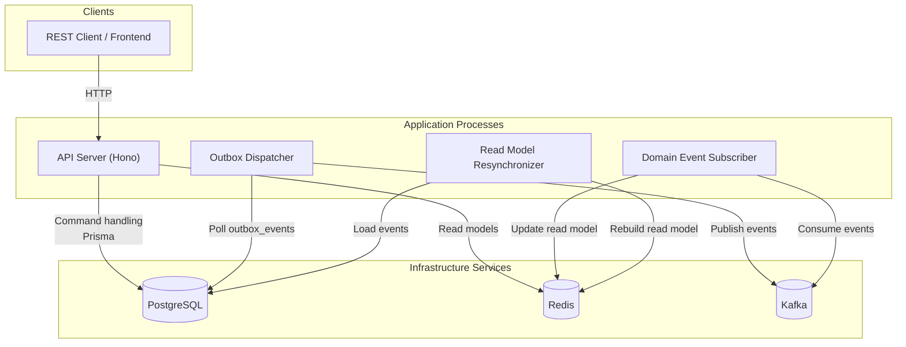
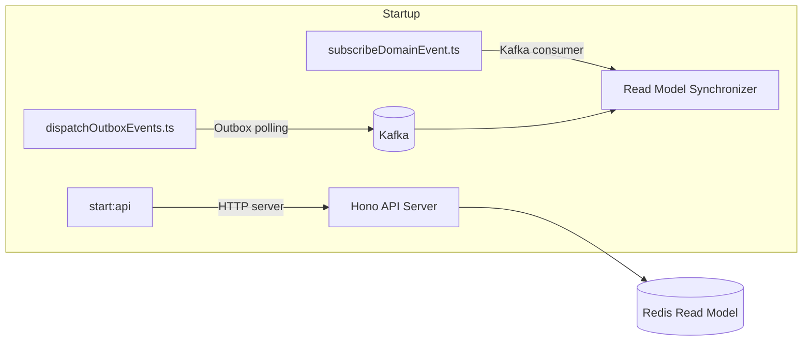
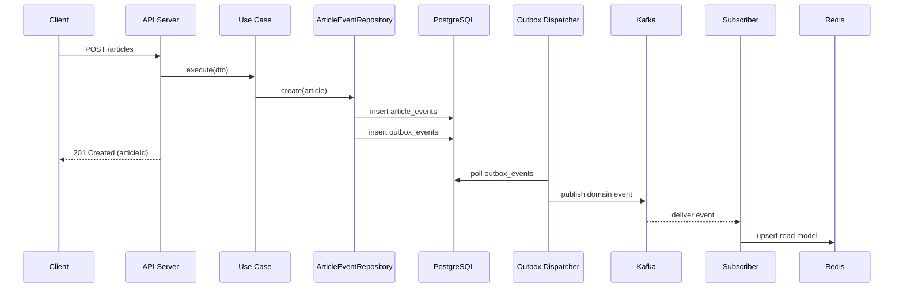
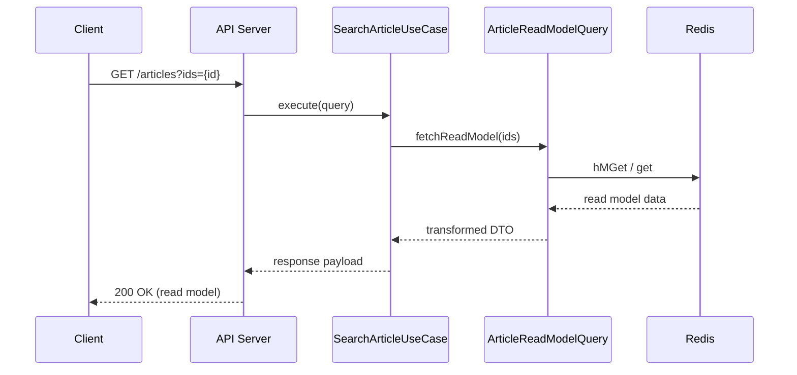

# 概要

DDDを学習するためのリポジトリ。
記事投稿サービスを題材にしている。

- DDDに基づくモジュール設計
- DDDに基づくドメインモデル設計
- コマンドクエリ分離(CQRS)パターンの実装
- イベントソーシングパターンの実装
- Outboxパターンの実装
- Hono.jsを利用したAPIサーバーの実装
- Zodを利用したスキーマベースのバリデーション
- Prismaを利用した型安全なDBアクセス
- Apache Kafkaを利用したドメインイベントの発行・購読
- smallテスト・E2Eテストの実装

## コマンド

| コマンド | 説明 |
| --- | --- |
| `pnpm install` | 依存パッケージをインストールします。 |
| `pnpm start:all` | API サーバー・ドメインイベント購読プロセス・アウトボックスディスパッチャ・リードモデル再同期バッチを一括で起動します。 |
| `pnpm start:api` | API サーバーだけを起動します。ホットリロード対応。 |
| `pnpm subscribe` | Kafka の購読プロセスを単体で起動します。 |
| `pnpm outbox` | Outbox テーブルをポーリングし、未送信イベントを Kafka に配信します。 |
| `pnpm resync:readmodel` | PostgreSQL のイベントストアから Redis のリードモデルを再同期します。`RESYNC_INTERVAL_MS` を設定すると定期実行されます。 |
| `pnpm lint` / `pnpm lint:fix` | oxlint による静的解析（修正無し／自動修正あり）。 |
| `pnpm format` / `pnpm format:check` | Prettier によるフォーマッタ（上書き／チェック）。 |
| `pnpm test:small` | small テスト（ユニット＋インフラテストの一部）を実行します。 |
| `pnpm test:e2e` | Docker Compose を立ち上げた上で E2E テストを実行します。 |
| `pnpm doc` | OpenAPI ドキュメントを生成します。 |
| `pnpm migration` | Prisma のマイグレーションを実行します。 |
| `pnpm teardown` | テスト用の Docker コンテナ・ボリュームの削除、各種のnodeプロセスを終了します。 |

## システム構成図

## 使用技術

- Hono.js : APIサーバフレームワーク
  - @hono/zod-openapi : ZodのスキーマからOpenAPIのスキーマを生成するためのパッケージ
  - @hono/node-server : Node.jsでHonoを動かすためのパッケージ
  - hono-simple-di : Honoで依存性注入を行うためのパッケージ
  - @scalar/hono-api-reference : HonoのAPIリファレンスを生成するためのパッケージ
- Apache Kafka : ドメインイベントの発行・購読
- PostgreSQL : コマンドクエリ分離におけるコマンド側(書き込み用)DB
- Redis : コマンドクエリ分離におけるクエリ側(読み取り用)DB
- Prisma : 型安全なORM
- Zod : スキーマベースのバリデーションライブラリ
- Vitest : テストフレームワーク
- oxlint : 静的解析ツール
- Prettier : コードフォーマッタ

## 使用実装パターン

### DDD (ドメイン駆動設計)

境界づけられたコンテキストごとにモジュールを分割し、「コンテキスト内の業務知識を単純化し、オブジェクトとして表現したもの=ドメインモデル」を中心に据えた設計手法です。

実装をする際は`ドメインモデル → ユースケース → インフラ`の順に設計・実装を進めていきます。

### クリーンアーキテクチャ

DDDを実装する際に用いられるアーキテクチャパターンの一つです。
クリーンアーキテクチャでは、ドメイン層を中心に据え、依存関係はすべて**外側から内側へ**向かいます。

- 「controller」「外部システムとの連携」「DBとのやり取り」はインフラ層に属する
- それぞれの層をつなぐインターフェースを定義し、上位層が下位層の抽象に依存する形にする
- データ変換は外側の層が担当し、内側の層は純粋なドメインオブジェクトを扱うだけにする
- データの変換にはDTO(Data Transfer Object)を利用する

### CQRS

コマンド（状態を変更する操作）とクエリ（状態を読み取る操作）を分離するパターンです。

### イベント駆動

システムの状態変化をイベントとして表現し、そのイベントに基づいて他のコンポーネントが反応する設計手法です。
このリポジトリではKafkaを利用してドメインイベントを発行・購読することで、イベント駆動を実現しています。

### Outboxパターン

分散システムにおいて、データベースの更新とメッセージングシステムへのイベント発行を一貫性を持って行うためのパターンです。
このリポジトリでは、ドメインイベントの発行をOutboxパターンに基づいて実装しています。

### イベントソーシング

システムの状態をイベントの履歴として保存し、そのイベントを集約して現在の状態を再構築するパターンです。
このリポジトリでは、記事イベントをPostgreSQLに保存し、そのイベントを集約して記事オブジェクトを生成しています。

## ディレクトリ構成

- modules : 境界づけられたコンテキストごとのモジュール
  - article : 記事コンテキスト
    - application : ユースケース層
      - dto : ユースケースの関数の引数・戻り値の型定義。Zodでバリデーションも行う
        - input : ユースケースの入力Data Transfer Object
        - output : ユースケースの出力Data Transfer Object
      - adapter : ユースケースのアダプター
        - inbound : APIコントローラーからの呼び出しを受けるアダプター(interface)
        - outbound : ドメインサービスやリポジトリを呼び出すアダプター(interface)
    - domain : ドメイン層
      - events : 記事イベントの定義
      - vo : 値オブジェクトの定義
        - Article.ts : 記事の集約。記事イベントを集約して記事オブジェクトを生成する  
    - infrastructure : インフラ層
      - http
        - controllers : APIコントローラー
        - schemas : OpenAPIスキーマ定義
      - mapper : ドメインイベントをKafkaやDBのスキーマに変換するマッパー
      - messaging : ドメインイベントをやり取りするKafkaのプロデューサー・コンシューマー
      - persistence : 永続化層の実装
        - ArticleEventCommandRepository .ts : 記事イベントのリポジトリ実装。Prismaを利用してPostgreSQLに保存する　 
      - readmodel : 読み取り用モデルの定義。Redisに保存する
        - ArticleReadModel.ts : 記事の読み取り用モデル。Redisに保存する
        - ArticleReadModelQuery.ts : 記事の読み取り用モデルのクエリインターフェース
        - ArticleReadModelSynchronizer.ts : 記事の読み取り用モデルをRedisに同期するコンポーネント。記事イベントを受けて読み取り用モデルを更新・削除する
    - dependencies.ts : 依存関係の注入設定
    - index.ts : hono.jsのルーター定義  
  - user : ユーザコンテキスト(未実装)
  - shared : 複数コンテキストで共有するモジュール
    - utils
      - exception : 共通例外クラス
      - validator : 共通バリデーション関連
      - vo : 共通値オブジェクト
    - infrastructure : 共通インフラ層
      - OpenAPI.ts : OpenAPIのメソッド定義
      - Kafka.ts : Kafkaのメソッド定義
      - Redis.ts : Redisのメソッド定義
  - index.ts : Honoのルーターをまとめる
- scripts
  - generateOpenAPI.ts : OpenAPIのスキーマを生成するスクリプト
  - subscribeDomainEvent.ts : Kafkaに接続してドメインイベントの購読を開始するスクリプト
  - dispatchOutboxEvents.ts : Outboxテーブルを監視し未送信イベントをKafkaへ配信するバッチ
  - resynchronizeArticleReadModel.ts : PostgreSQLのイベントストアを基にRedisのリードモデルを再同期するバッチ
- rest-client : ローカルでAPIを試すためのRESTクライアント
- prisma : Prismaのスキーマ定義
- server.ts : APIサーバーのエントリーポイント

## 処理の流れ

### 用語

- 記事イベント : 記事の登録・更新・削除などの記事に関する操作を表すイベント。PostgreSQLに保存される.実際の記事情報を生成するには、記事イベントを集約して記事オブジェクトを生成する必要がある.
- 読み取り用モデル : Redisに保存される記事の読み取り用データ.記事イベントを集約して生成される.
- ドメインイベント : 記事登録完了などのドメインに関する重要な出来事を表すイベント.**記事イベントとは別物であり**、他のコンテキストやシステムに通知するために使用される.
- Outboxイベント : ドメインイベントを安全に発行するための仕組み.Outboxパターンを実装している.

### サーバーの起動

1. (起動時一回のみ) Kafkaに接続してドメインイベントを購読する購読者プロセスを起動する。これはAPIサーバーとは別プロセスで起動する必要がある。
2. (起動時一回のみ) Outboxイベントを定期的にチェックして、未発行のOutboxイベントをKafkaに発行するプロセスを起動する。これはAPIサーバーとは別プロセスで起動する必要がある。
3. Hono.jsのAPIサーバーを起動する

### 記事の登録

1. Hono.jsのAPIサーバーで記事登録APIを受け付ける
2. Zodでリクエストボディのバリデーションを行う
3. 記事登録用のユースケースを呼び出す
4. ユースケース内で記事登録用のドメインサービスを呼び出す
5. 同じ作者が同じタイトルの記事を登録していないかを検証する
6. ドメインサービス内で**記事イベント**を生成する
7. Prismaを利用してPostgreSQLに**記事イベント**を登録する
8. Prismaを利用してOutboxイベントを登録する
9. 以下の処理を非同期で実行する
    A. APIサーバーからのレスポンスを返す
    B. Outboxパターンに基づいた読み取り専用モデルの更新処理
        1. (非同期)Outboxイベント発行プロセスが未発行のOutboxイベントを検知する
        2. 未発行のOutboxイベントをKafkaに発行する
        3. (非同期) Kafkaの購読者プロセスが記事登録完了のドメインイベントを受け取る
        4. (非同期) 購読者プロセスはRedisを操作して記事の読み取り用モデルを更新する

### 読み取りモデル更新の障害時

- Kafka 購読プロセスはイベント処理に失敗した場合、既定で最大 3 回まで指数的に遅延させつつリトライします。
- それでも失敗したイベントは `article-events-dead-letter` トピックに退避され、後続の手動リカバリやバッチ再処理の材料になります。

### 記事の取得

1. Hono.jsのAPIサーバーで記事取得APIを受け付ける
2. Zodでリクエストボディのバリデーションを行う
3. 記事取得用のユースケースを呼び出す
4. ユースケース内でRedisから記事の読み取り用モデルを取得する
5. APIサーバーからのレスポンスを返す

