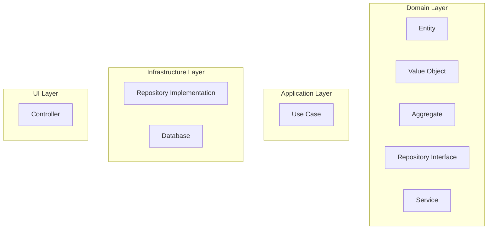

# ドメイン駆動開発とは

ドメイン駆動開発とはソフトウェアの開発を**業務領域=ドメイン\*\***を中心に進める\*\*開発手法です。エリック・エヴァンスの著書『ドメイン駆動設計』で提唱されました。
ドメイン駆動開発はvalue objectやentity、aggregateなどの概念を用いてドメインをモデル化し、ソフトウェアに反映させることを目指します。

## なぜドメイン駆動開発が必要なのか

「複雑なビジネスロジックとの親和性」「AIエージェントに適したアーキテクチャ」であるため、ドメイン駆動設計を学びます。

- **複雑なビジネスロジックの管理**: ドメイン駆動開発は、複雑なビジネスルールやロジックを整理し、理解しやすくするための手法です。これにより、開発者はビジネスの本質に集中でき、コードの品質が向上します。
- **AIコーディングエージェントとの親和性**: ドメイン駆動開発は、AIコーディングエージェントがビジネスドメインを理解しやすくするための基盤を提供します。これにより、AIが生成するコードの品質が向上し、開発者の生産性が向上します。
- **コードの保守性と拡張性の向上**: ドメイン駆動開発は、コードをビジネスドメインに基づいて構造化するため、変更や拡張が容易になります。これにより、将来的な要件変更に柔軟に対応できます。
- **チーム間のコミュニケーションの改善**: ドメイン駆動開発は、共通の言語と理解を提供するため、開発チームとビジネスチームの間のコミュニケーションが改善されます。これにより、要件の誤解やミスコミュニケーションが減少します。
- **テスト容易性の向上**: ドメイン駆動開発は、ビジネスロジックを明確に分離するため、ユニットテストや統合テストが容易になります。これにより、コードの品質と信頼性が向上します。

## ドメイン駆動設計の基本概念

- **業務領域（ドメイン）**: ソフトウェアが解決しようとする問題領域。ドメイン駆動設計では業務領域を「中核の業務領域」「一般的な業務領域」「補助的な業務領域」に分類します。
- **境界づけられたコンテキスト (Bounded Context)**: ドメインの一部を明確に区切り、その中で一貫したモデルと用語を使用する。これにより、異なるコンテキスト間での混乱を防ぎます。コンテキストの境界はマイクロサービスやチームの境界に対応することが多いです。境界づけられたコンテキスト同士は後述のイベントを用いて連携します。
- **ユビキタス言語 (Ubiquitous Language)**: 開発者とビジネス関係者が共有する共通の言語。ドメインモデルに基づいており、コード、ドキュメント、会話で一貫して使用されます。
- **ドメインイベント**: ドメイン内で発生する重要な出来事を表すオブジェクト。イベントはシステムの状態変化を表現し、他のコンテキストやシステムと連携するために使用されます。

- **Value Object (値オブジェクト)**: **不変**で識別子を持たないオブジェクト。属性の集合として定義され、同一性ではなく値によって等価性が判断される。
- **Entity (エンティティ)**: 識別子を持ち、ライフサイクルを通じて同一性が維持されるオブジェクト。属性が変化しても識別子によって同一性が保たれる。
- **Aggregate (アグリゲート)**: 関連するエンティティと値オブジェクトの集合で、一貫性の境界を形成する。 アグリゲートはルートエンティティを持ち、外部からのアクセスはルートエンティティを通じて行われる。
- **Repository (リポジトリ)**: ドメインオブジェクトの永続化と取得を担当する。リポジトリはドメインモデルとデータストアの間の橋渡しを行う。
- **Service (サービス)**: ドメインロジックを実装するための操作を提供する。サービスは状態を持たず、ドメインオブジェクトの操作を行う。

## ドメイン駆動設計に関連するパターン

### 依存性の逆転

ドメイン駆動設計では後述のクリーンアーキテクチャやヘキサゴナルアーキテクチャを実現するために依存性の逆転を利用します。
具体的には、ドメイン層がインフラストラクチャ層に依存しないようにし、インターフェースを通じて依存関係を逆転させます。

### クリーンアーキテクチャ・ヘキサゴナルアーキテクチャ

クリーンアーキテクチャやヘキサゴナルアーキテクチャなどは、ドメイン駆動設計との親和性が高いアーキテクチャパターンです。
ドメイン駆動設計ではドメイン層を中心に据え、他の層（アプリケーション層、インフラストラクチャ層、UI層など）がドメイン層に依存する形で設計します。

#### レイヤードアーキテクチャとクリーンアーキテクチャの責務の違い

レイヤードアーキテクチャでは依存関係は
**「Controller」→「Service」→「Repository」→「Database」** のように上位層から下位層へと流れます。

この場合、上位レイヤーは下位レイヤーに強く依存します。
具体的には、**上位レイヤーが下位レイヤーに合わせてデータを整形して渡す責務を持つ**ことになります。

例えば Service 層から Repository 層にデータを渡すとき、

- Service が「Repositoryが期待する形」にデータを変換する
- Repository は受け取ったデータをそのまま保存する

という関係になりやすいです。

**結果的に、Repository の実装が変わると、それに合わせて Service も修正を迫られる**という問題が生じます。
つまり「下位層の都合が上位層に波及しやすい」構造です。

クリーンアーキテクチャではドメイン層を中心に据え、依存関係はすべて**外側から内側へ**向かいます。
典型的な構造は **「Domain（Entity）」→「Use Case」→「Interface Adapter」→「Infrastructure」** です。

この場合のデータ変換は、**上位層ではなく外側（AdapterやInfrastructure側）が行う**点が重要です。
流れを整理すると：

1. **Use Case層** はドメインオブジェクトをリポジトリの抽象（インターフェース）に渡す
2. **Interface Adapter層** が、ドメインオブジェクトを外部システムが扱える形式（DB行やDTOなど）に変換する
3. **Infrastructure層** が、その変換後データを実際に保存する

つまり、**ドメインやユースケースは保存形式を一切意識しない**構造になります。
例えば、先ほどのService 層から Repository 層にデータを渡すときの例でいうと

- Use Case が「ドメインオブジェクト」をそのままリポジトリのインターフェースに渡す
- Interface Adapter が「ドメインオブジェクト」を「Repositoryが期待する形」に変換する
- Repository は受け取ったデータをそのまま保存する

になります。(上の層が下の層の抽象に依存する)

- **レイヤード**
  - 上位層（Service）が下位層（Repository）に合わせて変換する
  - 下位層の変更が上位層に波及しやすい

- **クリーン**
  - 内側（Use Case）は純粋なドメインオブジェクトを扱うだけ
  - 外側（Adapter, Infrastructure）が変換や保存を担当
  - インフラの差し替えが容易で、ドメインは影響を受けない

### イベントソーシング

ドメイン駆動設計では、システムの状態をイベントの履歴として保存するイベントソーシングを利用することがあります。
例えば、車の販売を行うシステムにおける顧客テーブルを考えます。顧客の情報は頻繁に変更されるため、顧客テーブルの状態を直接保存するのではなく、顧客が作成されたイベント、顧客情報が更新されたイベント、顧客が削除されたイベントなどの一連のイベントとして保存します。
実際の業務において、データを分析する際は、特定の時点での状態を知りたい場合があります。イベントソーシングを利用することで、過去の状態を容易に再現できるため、分析が容易になります。

イベントソーシングは **「よりドメイン(業務)が利用しやすいシステムを構築することができる」**というメリットの反面、**「システムの複雑性が増す」**というデメリットもあるため
慎重に採用を検討する必要があります。

### CQRS (Command Query Responsibility Segregation)

CQRSはコマンド（状態を変更する操作）とクエリ（状態を読み取る操作）を分離するパターンです。
ドメイン駆動設計では、CQRSを利用して読み取りと書き込みの責務を分離します。
読み取りと書き込みでは関心事が異なるため、異なるデータモデルやストレージを使用することができます。

- **読み取りモデル**: クエリ操作に最適化されたデータモデル。通常、冗長性が許容され、パフォーマンスが重視されます。
- **書き込みモデル**: コマンド操作に最適化されたデータモデル。データの整合性と一貫性が重視されます。

### ORM (Object-Relational Mapping)

ORMはオブジェクト指向プログラミングとリレーショナルデータベースの間のマッピングを提供する技術です。
わかりやすく言うとコード上のクラスオブジェクトとデータベース上のテーブルを対応付ける技術です。
ドメイン駆動設計では、エンティティ=テーブルではないため、Prismaのような柔軟なORMを利用することもできます。

### バリデーション

ドメイン駆動設計では、ドメインモデルの整合性を保つためにバリデーションが重要です。
例えばValue Objectの不変性を保つために、生成時にバリデーションを行う責務を持たせます。
また、Entityでは属性の変更時にバリデーションを行い、値が正しいことを保証します。
バリデーションを実装するためのライブラリとしてZodやJoiなどがあります。
